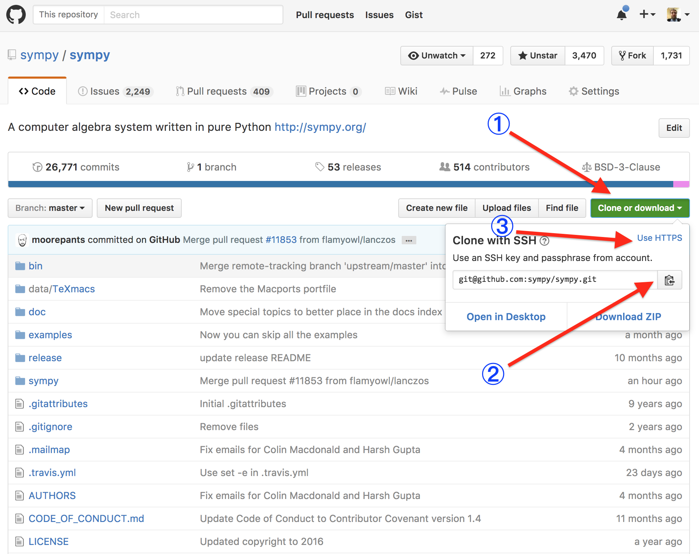
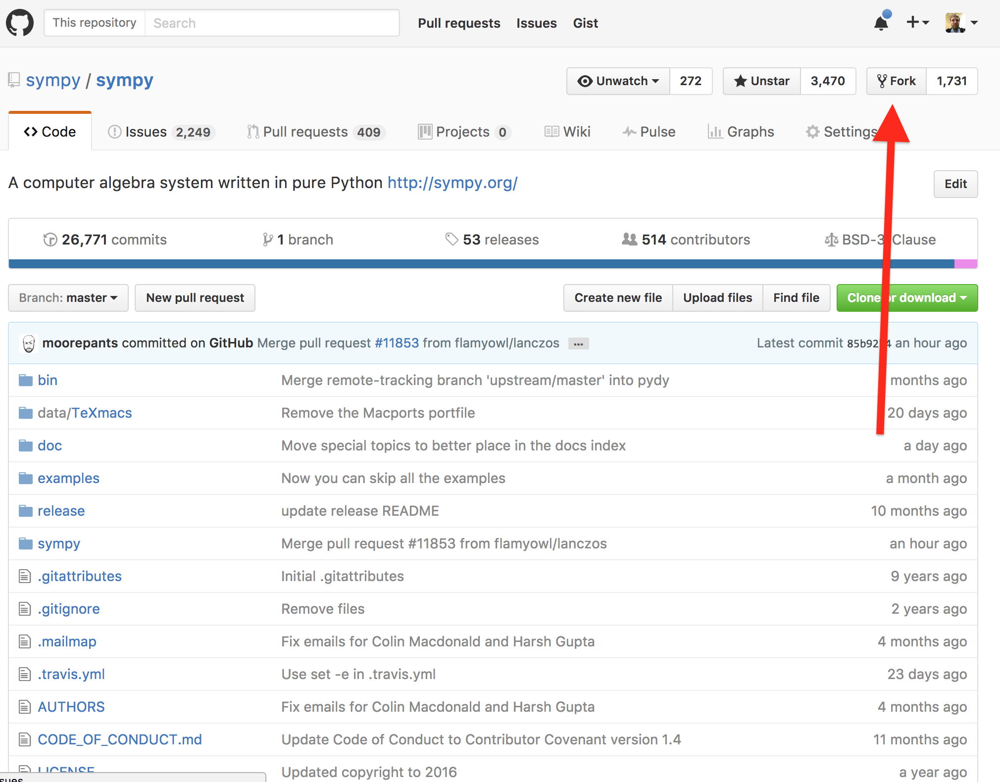
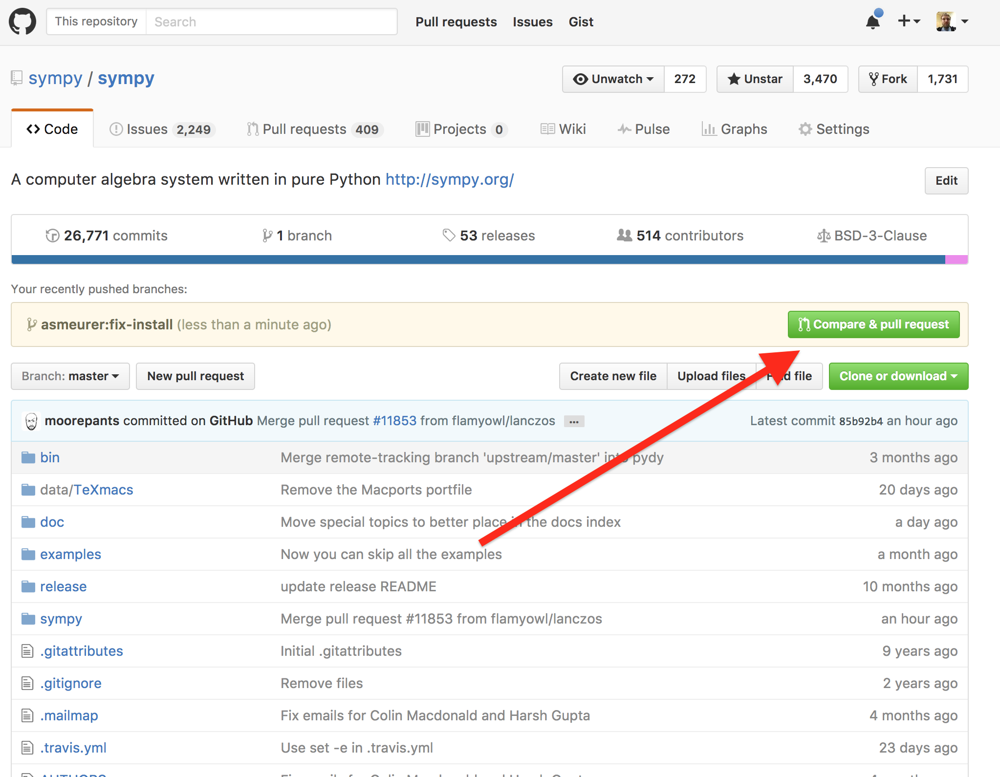

# Git workflow

This document describes the git workflow that should be used when contributing
to open source projects. It assumes a very basic understanding of git
(commits, branches, etc.) using the command line.

*Note: This workflow is designed for open source (i.e., public)
repositories. The workflow for private repositories may be slightly different,
in particular, the repository's team may prefer for you to not fork the repo
but rather push branches to it directly (although note that GitHub does allow
you to fork private repositories that you have push access to and keeps the
fork private).*

For this document, we will suppose that you want to contribute a patch to
[conda/conda](https://github.com/conda/conda).

## Cloning and forking the repository

**Note: The steps in this section only need to be performed once per
repository (e.g., if you contribute a second change to conda/conda, you would
not need to repeat them, but if you contribute to
[conda/conda-build](https://github.com/conda/conda-build) you will need to
repeat them for that repository).**

1. **Clone the repository.** Copy the url <font color="blue">①</font> and
   type

   ``` git clone <clone url> ```

   at the terminal. Replace `<clone url>` with the url that has been copied to
   your clipboard. For conda/conda, it will be
   `git@github.com:conda/conda.git`. If you have not set up your ssh keys with
   GitHub, use the https url by first clicking the `https` button <font
   color="blue">②</font>.

   

   *Note: It is important that you clone from the repo you are contributing
   to (like conda/conda),* not *your fork of the repo.*

2. **Fork the repo on GitHub to your personal account.** Click the `Fork`
   button on the conda/conda page.

   

   If you are presented with a list of organizations, click on your GitHub
   username.

3. **Add your fork as a remote.** You can name this remote anything, but
   common choices are `github` or your GitHub username. For consistency in
   this document, we will call the remote `github`. Go to the fork of your
   repository, in this case, `https://github.com/<your username>/conda` (replace
   `<your username>` with your GitHub username), and copy the clone url as in
   step 1. `cd` to your clone from step 1 and run

   ```
   git remote add github <fork url>
   ```

   (replace `<fork url>` with the url that was copied to your
   clipboard). You will be able to tell it is your fork url because it will
   have your GitHub username in it. For instance, if your username is
   `github_user`, your fork url would be
   `git@github.com:github_user/conda.git`.

Remember, the above three steps only need to be performed once per
repository. Once you have cloned and forked a repository once, there is no
need to clone or fork it again.

## Making changes

Before you make any changes, you should make a branch. Remember to **never
commit to master**. The command `git status` will tell you what branch you are
on. I recommend putting the git branch in your command prompt, so that you
will always know what branch you are on. See
[this guide](http://stackoverflow.com/a/24716445/161801) on how to do this.

It is important that you never commit to master because master will be the
branch that you pull upstream changes from (e.g., changes from
conda/conda).

1. **Update master.** Before you make any changes, first checkout master

   ```
   git checkout master
   ```

   and pull in the latest changes

   ```
   git pull
   ```

   This will make it so that your changes are against the very latest master,
   which will reduce the likelihood of merge conflicts due to your changes
   conflicting with changes made by someone else.

2. **Create a branch.** Once you have done this, create a new branch. You
   should make a branch name that is short, descriptive, and unique. Some
   examples of good branch names are `fix-install`, `docs-cleanup`, and
   `add-travis-ci`. Some examples of bad branch names are `feature`, `fix`,
   and `patch`. The branch name choice is not too important, so don't stress
   over it, but it is what people will use to reference your changes if they
   want to pull them down on their own computers to test them, so a good name
   will make it easier for others to understand what your branch does.

   To create the branch, run

   ```
   git checkout -b <branch name>
   ```

   (replace `<branch name>` with the branch name you chose). This will create a
   new branch and check it out. You can verify this with `git status`.

3. **Make your changes and commit them.** Once you have created your branch,
   make your changes and commit them. Remember to keep your commits atomic,
   that is, each commit should represent a single unit of change. Also,
   remember to write helpful commit messages, so that someone can understand
   what the commit does just from reading the message without having to read
   the diff.

   ```
   git add <file name>
   git commit -a -m "Descriptive commit message saying what we changed."
   ```

4. **Push up your changes.**  Push your changes to your fork. Do this by
   running

   ```
   git push github <branch name>
   ```

   (replace `<branch name>` with the name of the branch). If you named your
   remote something other than `github` use that instead.

5. **Make a pull request.** If you then go to your fork on GitHub, you should
   see a button to create a pull request from your branch. It will look
   something like this:

   

   If you do not see this, select the branch from the branch popup <font
   color="blue">①</font> and click the pull request button <font
   color="blue">②</font>.

   

   Once doing this, you will be presented with a page. This page will show you
   the diff of the changes. Double check them to make sure you are making a
   pull request against the right branch.

   Things to check here are that the base fork is the upstream repo <font
   color="blue">①</font> (in this case, conda/conda) and the branch for the
   upstream repo is master, and that the head fork is your fork <font
   color="blue">②</font> and the branch is the branch you wish to make the
   pull request from.

   Enter a descriptive title in the title field <font
   color="blue">③</font>. This is very important, as it is what will show up
   in the pull request listing and in email notifications to the people in the
   repo. Pull requests with undescriptive titles are more likely to be passed
   by. If there is more description or discussion about the pull request than
   what fits in the title field use the description field <font
   color="blue">④</font>.

   Once you are done, click the "create pull request" button <font
   color="blue">⑤</font>.

   

6. **Pushing additional changes**. Once you have created the pull request, it
   will likely be reviewed and some additional fixes will be necessary.  **Do
   not create a new pull request.** Rather, simply make more commits to your
   branch and push them up as in steps 3 and 4. They will be added to the pull
   request automatically.  Note that GitHub does not notify people when you
   push new changes to a branch, so it is a good idea to make a comment on the
   pull request whenever you do so to notify people that it is ready to be
   reviewed again.

Once the pull request has been reviewed successfully, someone with push access
to the main repository will merge it in. At this point you are done. You can
checkout master and pull as described in step 1 and your changes should be
there.

## Important points

The important things to remember from this document are

1. You only need to clone and fork once per repository.

2. Always clone from the main repository and add your fork as a remote.

3. Never commit to master. Create a branch and commit to it.

4. Use `git status` often to check what branch you are on and see if you have
   any uncommitted changes.

5. Be descriptive in your branch names, commit messages, and pull request
   title and descriptions.

6. Once you have a pull request for a branch, you can push additional changes
   to the same branch and they will be added to the pull request
   automatically. You should never create a new pull request for the same
   branch.
